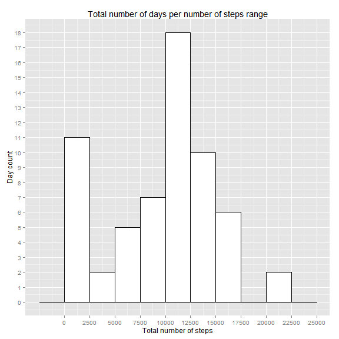
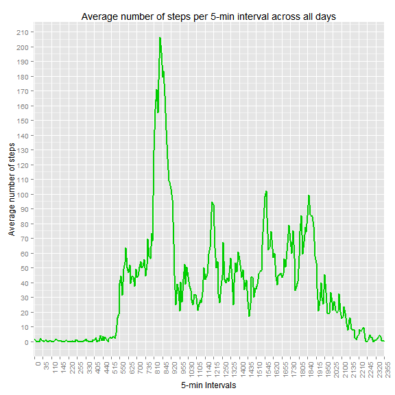
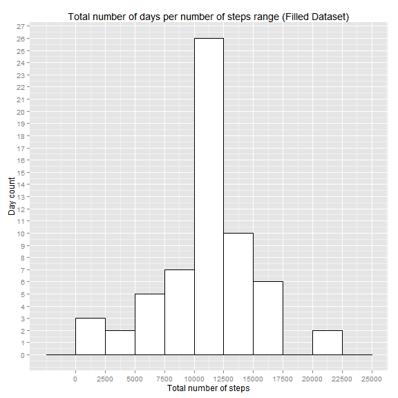

Coursera Data Science Specialization - Reproducible Research
============================================================
Activity Monitoring Data Project
--------------------------------
#### Student: Mario Albuquerque

### Set global options and package requirements

```r
options(echo=TRUE,scipen=1,digits=2)
if(!require('ggplot2')){install.packages('ggplot2')}
```

```
## Loading required package: ggplot2
```

```r
library(ggplot2)
```

### Loading and preprocessing the data

The following code assumes that the user has already downloaded and unzipped the csv file in **https://d396qusza40orc.cloudfront.net/repdata%2Fdata%2Factivity.zip**. The data is assigned to a data frame named *stepActivity*.


```r
#Read data into stepActivity data frame
stepActivity<-read.csv('activity.csv',colClasses=c('numeric','Date','numeric'),header=TRUE)
#Assign new names
names(stepActivity)<-c('Steps','Date','Interval')
```

### Mean total number of steps taken per day

Aggregate number of steps on *stepActivity* data frame, based on *Date*, using the sum function and create data frame.

```r
sumDailySteps<-tapply(X=stepActivity$Steps,INDEX=stepActivity$Date,FUN=sum,na.rm=TRUE)
dailyStepSummary<-data.frame('Total_Steps'=sumDailySteps)
```

Report the average and median steps taken per day:

Statistic|Value
----|----
Average|9354.23
Median|10395

Finally, plot the histogram of the total number of days per number of steps range:


```r
print(ggplot(dailyStepSummary,aes(x=Total_Steps))+geom_histogram(binwidth=2500,colour='black',fill='white')+xlab('Total number of steps')+ylab('Day count')+ggtitle('Total number of days per number of steps range')+scale_x_continuous(breaks=seq(0,25000,by=2500))+scale_y_continuous(breaks=seq(0,18)))
```

 

### Average Daily Activity Pattern

First compute the average number of steps within each interval, across all days, and create a dataframe that connects this average with each 5-min interval:

```r
#Average of number of steps within each 5-min interval across all days
avgIntervalSteps<-tapply(X=stepActivity$Steps,INDEX=stepActivity$Interval,FUN=mean,na.rm=TRUE)
#Create dataframe that aggregates average data and interval data to be ready for line plot
intervalStepSummary<-data.frame('Interval'=unique(stepActivity$Interval),'Average_Steps'=avgIntervalSteps)
#Convert Interval variable to factor so that when plotting the lines, R does not automatically fills numbers (ex. between 55 and 100)
intervalStepSummary$Interval<-factor(intervalStepSummary$Interval)
```

Plot the line that shows the average number of steps for each 5-minute interval, across all days:

```r
#Make the plot
print(ggplot(intervalStepSummary)+geom_line(size=1,col=3,aes(x=Interval,y=Average_Steps,group=1))+xlab('5-min Intervals')+ylab('Average number of steps')+ggtitle('Average number of steps per 5-min interval across all days')+scale_y_continuous(breaks=seq(0,220,by=10))+scale_x_discrete(breaks=intervalStepSummary$Interval[seq(1,length(intervalStepSummary$Interval),by=7)])+theme(axis.text.x=element_text(angle=90,hjust=1)))
```

 

The max number of average steps taken is 206.17, and the 5-minute interval that contains the maximum number of average steps taken is 835.

### Imputting Missing Values

The total number of missing values in the dataset is 2304.

Replace *NA* by the mean number of steps taken in the respective 5-minute interval:

```r
#First, make a copy of the data to a new data frame
stepActivityCleaned<-stepActivity
#Next, do a loop in order to fill missing values with the average number of steps for the respective 5-minute interval
for (i in 1:nrow(stepActivityCleaned)) {
  if (is.na(stepActivityCleaned[i,1])==TRUE)
  {stepActivityCleaned[i,1]<-intervalStepSummary[intervalStepSummary$Interval==stepActivityCleaned[i,3],2]}
}
#Aggregate number of steps on the new datasetby date
sumDailyStepsCleaned<-tapply(X=stepActivityCleaned$Steps,INDEX=stepActivityCleaned$Date,FUN=sum,na.rm=TRUE)
#Get unique number of days
uniqueDaysCleaned<-unique(stepActivityCleaned$Date)
dailyStepSummaryCleaned<-data.frame('Total_Steps'=sumDailyStepsCleaned)
```

Plot the new histogram, with the *NA* values replaced:

```r
#Finally, make a histogram of the total number of steps per day
print(ggplot(dailyStepSummaryCleaned,aes(x=Total_Steps))+geom_histogram(binwidth=2500,colour='black',fill='white')+xlab('Total number of steps')+ylab('Day count')+ggtitle('Total number of days per number of steps range (Filled Dataset)')+scale_x_continuous(breaks=seq(0,25000,by=2500))+scale_y_continuous(breaks=seq(0,30)))
```

 

Report the mean and median total number of steps taken per day:

Statistic|Value
----|----
Average|10766.19
Median|10766.19

These values differ from the prior case, where *NA* values are not replaced. The impact is to make the distribution "heavier" on its mean. This is the same as saying that the distribution becomes more symmetric than the previous case. This effect happens because the *NA* entries are effectively not adding to the total steps on a day, making the bar on the first step range of the histogram heavily populated. Once the *NA* values are replaced by the average of the respective 5-minute interval, it makes the left tail of the distribution less heavy and more centered around its mean. This effect is so strong in its magnitude that the mean becomes equal to the median, as the previous table reported.

### Activity Patterns in Weekdays and Weekends

First, flag weekdays and weekends appropriately, on the filled-in dataset.

```r
#Create new factor variable on the dataset and fill everything with 'weekday'
stepActivityCleaned['Day_Flag']<-factor(x='weekday',levels=c('weekday','weekend'))
#Now loop through all the dates and change cases appropriately for the weekends
for (i in 1:nrow(stepActivityCleaned)) {
  if (weekdays(stepActivityCleaned$Date[i])=='Saturday' | weekdays(stepActivityCleaned$Date[i])=='Sunday') {
    stepActivityCleaned$Day_Flag[i]<-factor(x='weekend',levels=c('weekday','weekend'))
  }
}
```

Compute the mean number of steps within each 5-minute interval of weekends and weekdays.

```r
aggSteps<-aggregate(x=list(Avg_Steps=stepActivityCleaned$Steps),by=list(Interval=stepActivityCleaned$Interval,Day_Flag=stepActivityCleaned$Day_Flag),FUN=mean)
#Convert Interval variable to factor so that when plotting the lines, R does not automatically fills numbers (ex. between 55 and 100)
aggSteps$Interval<-factor(aggSteps$Interval)
```


Plot the lines that show the average number of steps taken for each 5-min interval, separated by 'weekend' and 'weekday' panels:

```r
print(ggplot(aggSteps)+geom_line(size=1,col=3,aes(x=Interval, y=Avg_Steps,group=Day_Flag))+facet_wrap(~Day_Flag,ncol=1)+xlab('5-Minute Intervals')+ylab('Average Number of Steps')+ggtitle('Average Number of Steps per 5-minute Interval across weekdays and weekends')+scale_y_continuous(breaks=seq(0,240,by=20))+scale_x_discrete(breaks=aggSteps$Interval[seq(1,length(aggSteps$Interval)/2,by=7)])+theme(axis.text.x=element_text(angle=90,hjust=1)))
```

 

The previous plot shows, there are differences in the step activity patterns of weekdays and weekends:

- On weekdays, average number of steps pickup earlier than on weekends.
- On weekdays, after a spike in the average number of steps taken (probably due to the work commute), the average number of steps decreases to a lower plateau than on weekends.
- On weekends, the average number of steps taken decreases at a later hour than on weekdays.
